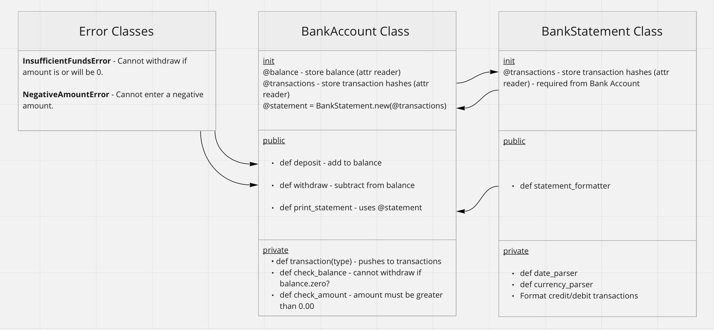

 


An irb Banking App that allows a user to: create an account, make deposits and withdrawals and view their account statement.


# Getting Started

- Clone the repo
```
git clone https://github.com/BenCoyne/bank_tech_test.git
```

- Install the Gems
```
bundle install
```


# Running the app

- In the terminal, run irb and require bank_account.rb
```
irb -r ./lib/bank_account.rb
```
- Create a new bank account
```
> my_account = BankAccount.new
```
- Deposit into the account
```
> my_account.deposit(100)
 => 100 
```
- Withdraw from the account
```
> my_account.withdraw(25.5)
 => 74.5 
```
- Repeat as you see fit and then print the account statement
```
> my_account.print_statement
date || credit || debit || balance
22/02/2022 || £10.00 || || £84.50
22/02/2022 || || £25.50 || £74.50
22/02/2022 || £100.00 || || £100.00

```

# Screenshot example

 

## Specification

### Requirements

* You should be able to interact with your code via a REPL like IRB or Node.  (You don't need to implement a command line interface that takes input from STDIN.)
* Deposits, withdrawal.
* Account statement (date, amount, balance) printing.
* Data can be kept in memory (it doesn't need to be stored to a database or anything).

### Acceptance criteria

**Given** a client makes a deposit of 1000 on 10-01-2023  
**And** a deposit of 2000 on 13-01-2023  
**And** a withdrawal of 500 on 14-01-2023  
**When** she prints her bank statement  
**Then** she would see

```
date || credit || debit || balance
14/01/2023 || || 500.00 || 2500.00
13/01/2023 || 2000.00 || || 3000.00
10/01/2023 || 1000.00 || || 1000.00
```


# Testing

All tests are written in RSpec and use Simplecov for the coverage analysis

- To run all tests
```
rspec
```
- To run individual tests
```
rspec spec/name_of_test_file.rb
```


# Planning: User stories and diagram

```
As a customer 
So I can have a bank account 
I want to be able to open a bank account 

As a customer
So I can accuaretly track my transactions
I want the default amount of money to be set to 0 

As a customer
So I can increase my account balance
I want to be able to deposit funds from my account 

As a customer
So I can receive my money
I want to be able to withdraw funds from my account  

As a customer
So I can see an accurate representation of my transactions 
I want to be able to print my account statement (date, amount, balance). 

As a customer
So I can easily ready my account balance 
I want the balance to be displayed in GBP to two decimal places 

As a customer
So I can better track my transactions
I want to see the most recent transaction first on the account statement. 

As a customer
So I cannot deposit an invalid amount
I want to see an error message if I deposit an amount <= 0

As a customer
So I cannot withdraw funds I do not have
I want to see an error message if I withdraw an amount > my account balance
```

 

# Implementation

- I began by writing user stories; adding to these/breaking them down if needed throughout the process.

- I then used Miro to diagram the class structures as a way to better understand how they would interact.

- There are two main classes in this app. BankAccount and BankStatement: BankAccount allows the user to create an account, make tranactions and print the account statement. BankStatement prepares/formatted the account statement for BankAccount to print.

- I used a TDD approach where I would slowly implement a class, then its functions based on the above planning materials. This allowed for a natural development process, only moving on to the next class or function when it was required. 

- I added classes for Error handling and refactored regularly throughout the process. 

- I hope you enjoy the app!